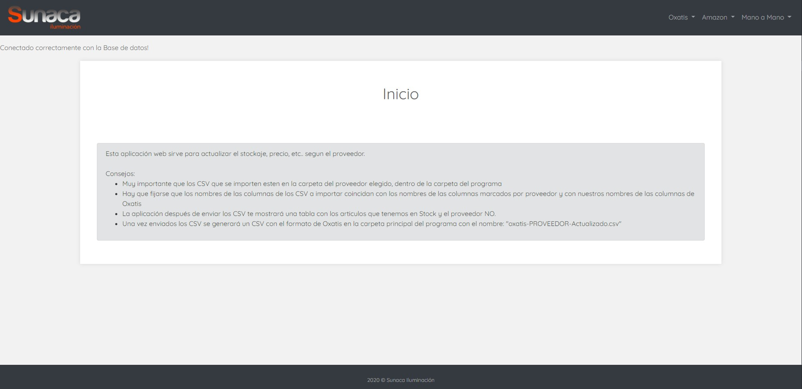
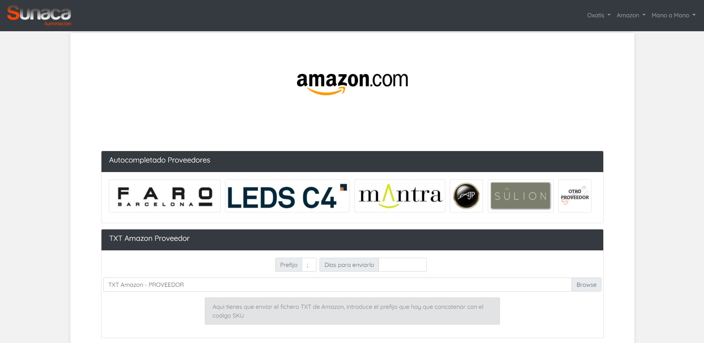
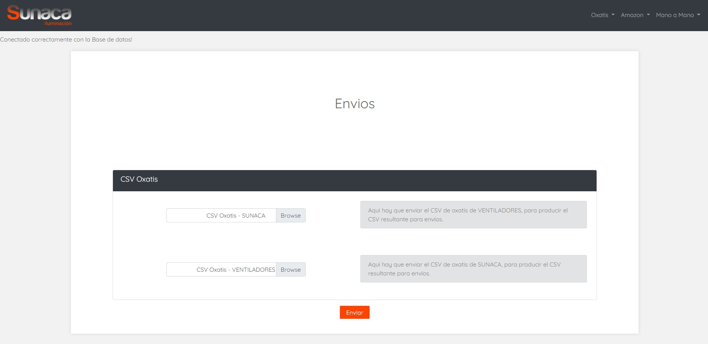

***

# Sunaca Iluminación Stock - 2020

***

### Información

***

Esta aplicación web esta construida con Bootstrap 4 y programado en PHP, HTML,
CSS y javaScript. Es una aplicación para una empresa real llamada Sunaca Iluminación,
realizada durante mi periodo de prácticas de empresa ICARO en ella.

Su funcionamiento se basa en la actualización del stockaje de la tienda online por
medio de ficheros CSV y TXT, segun para la plataforma en la que quieras actualizar
su stock, para Oxatis CSV, para amazon TXT y para Mano a Mano CSV.

La instalación de la aplicación web es muy sencilla, descargar la carpeta, pegarla
en el servidor web, importar la base de datos ('sunacadb.sql') en PHPMYADMIN y configurar la conexión
de la base de datos en el fichero 'conexion.php'.

***

***

***

***
